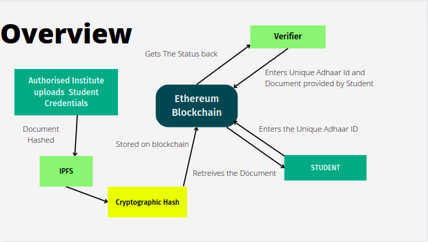
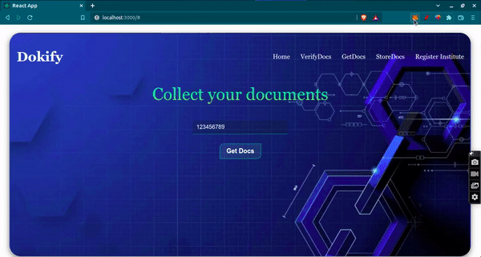

# Decentralised Credential Verification

The academic credential verification platform using blockchain technology is used to issue, manage and verify academic credentials in a secure and distributed manner. This project addresses the need for a secure digital platform to issue and verify academic credentials without intervention from the original certificate issuer (University).

## Overview



## Features

- This application provides a tamper-proof platform to universities and autonomous colleges to publish the credentials and also to verify the marks memos submitted by the students to the employers.
- Only the authorized universities can add certificates into the blockchain.
- The credentials of the students are added along with roll number, name, and Aadhar number.
- Student could Retrieve his/her credentials using a unique Adhaar ID
- Verification of certificate is done by uploading the softcopy provided by the insitute .

## Network Users

Universities

- Only Authorised Universities could Issue certificates

Students

- Student can verify the certificate provided by University
- Receive certificate pdf using unique Adhaar ID

Verifier

- Receive certificatefrom students.
- Verify certificate authenticity with blockchain platform.

Admin

- Authorise a particular University using its Metamask Public Address

## Tech Stack

**React**: Frontend of webapp is created using React\
**Solidity** : For writing smart contracts\
**Web3.js** : A javascript library to interact with on-chain components\
**Truffle** : Development framework for testing and deeplogying smartcontracts\
**IPFS** : The InterPlanetary File System is a protocol and peer-to-peer network for storing and sharing data in a distributed file system

## Run Locally

Clone the project

```bash
  git clone https://github.com/NitinJuyal1610/Decentralised-Credential-Verification
```

Go to the project directory

```bash
  cd projectDirectory
```

Install dependencies

```bash
  npm install
```

Start the server

```bash
  npm run start
```

## Demo

### Register Institute


### Store Credentials


### Verify Credentials


### Retrieve Credentials



## Credits

**Team member** -
[Jayant Sharma](https://github.com/Jayant135)
